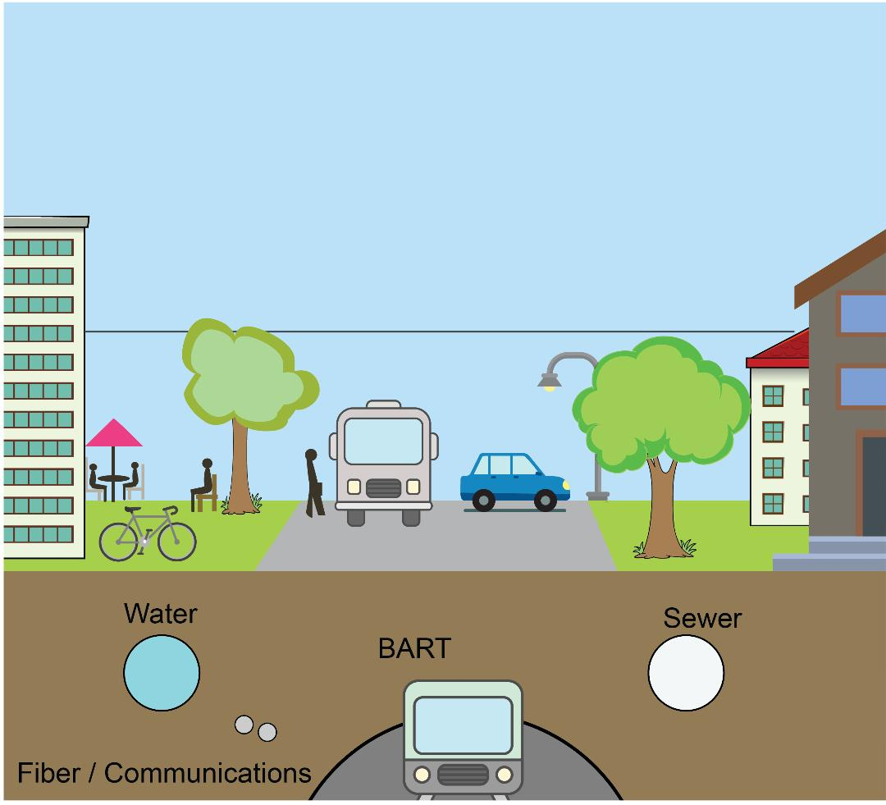

# **Section 1**
# **The Vision 2050 Initiative**

Vision 2050 is a citizen-led planning effort, convened by Mayor Jesse Arreguin, to create a common vision to guide physical infrastructure planning. The vision extends over 30 years to encourage long-term planning that will begin to meet the serious challenges of the 21st century— including climate change, inequality, population changes and aging infrastructure— and improve the quality of life for the next generation of Berkeley residents. Vision 2050 proposes to move beyond business-as-usual to accelerate the building of climate-smart, technologically advanced, integrated, and efficient infrastructure.

## What is Infrastructure?

 Miles of infrastructure work to keep our city functioning beneath our feet, under our tires, and all around us as we go from home to school and work, shop and eat in town, or just enjoy the company of neighbors. Some parts of this critical infrastructure are controlled by the City of Berkeley while other important components are controlled by our partners—EBMUD, PG&E, AC Transit, BART and others.

 Figure 1 shows the components above the ground, on the street surface and below ground. We call this the public commons.

Infrastructure on the surface is the most familiar feature—streets, sidewalks and bikeways that support cars, trucks, bikes and feet. On this streetscape, power and streetlight poles support electric and communications hardware, while trees and plants invite us to slow down and enjoy life, providing habitat for our wild neighbors, and improving the air we breathe.

Beneath our feet is another extensive world of cables, pipes, tunnels and vaults that we rarely think about until something breaks. This infrastructure delivers water to our homes and businesses, brings natural gas for heating and cooking, and takes away our sewage. It is also part of the electric and communications grids and home to Berkeley’s underground BART system.

Table 1 shows the magnitude of Berkeley’s infrastructure systems.
[Table 1A shows a constantly-updated catalog of Berkeley's infrastructure systems][infrastructureupdate]

<table>
<thead>
<tr class="header">
<th><strong>Berkeley Infrastructure Systems</strong></th>
<th></th>
<th></th>
</tr>
</thead>
<tbody>
<tr class="odd">
<td><strong>Infrastructure System</strong></td>
<td><strong>Controlled by City</strong></td>
<td><strong>Controlled by Others</strong></td>
</tr>
<tr class="even">
<td>
Streets, Sidewalks, Paths,

Bikeways, and Tunnels
</td>
<td>
216 miles of streets

300 miles of sidewalks

50 miles of paths and bikeways
</td>
<td>
AC Transit buses

BART system

Lyft and Uber

ZipCar, Gig, etc.
</td>
</tr>
<tr class="odd">
<td>Power and Communication Systems</td>
<td>7,000 street lights</td>
<td>
PG&amp;E electricity and natural gas delivery systems

Private telecommunications and Internet services
</td>
</tr>
<tr class="even">
<td>Parks and Street Trees and public plantings</td>
<td>
38,000 street trees

52 parks
</td>
<td></td>
</tr>
<tr class="odd">
<td>Water Supply System</td>
<td><blockquote>

11 creek watersheds

</blockquote></td>
<td>EBMUD potable and recycled Water</td>
</tr>
<tr class="even">
<td>Sewers</td>
<td><blockquote>

380 miles of sewers

</blockquote></td>
<td>EBMUD sewage treatment</td>
</tr>
<tr class="odd">
<td>Storm Water System</td>
<td>
220 miles of storm drains

6,000 storm drain facilities
</td>
<td></td>
</tr>
<tr class="even">
<td>Solid Waste Management</td>
<td>
7 acre transfer and recycling station

Curbside collection services for over 23,000 homes and businesses

Commercial food waste collection
</td>
<td>
Alameda County landfill

Alameda County household hazardous waste services

Alameda County construction &amp; demolition debris services
</td>
</tr>
</tbody>
</table>

## What is the Problem?
Berkeley, along with much of the United States, is faced with infrastructure that was built 80+ years ago.

Many facilities in Berkeley were built as part of the Works Progress Administration (WPA) in the late 1930’s. Those projects included Aquatic Park, the Berkeley yacht harbor, Rose Garden, Civic Center, the Community Theater on the Berkeley High campus, and many other facilities. The City’s streets, storm drains, sewers, and EBMUD’s water lines are also of similar age, if not older. The problem with aging infrastructure is that they are susceptible to unplanned failure, cause service interruptions, cost more to maintain and don’t meet current requirements.

Our infrastructure systems are old, 
much of it is at the end of its useful life. How we got to this situation is also a problem. We have not planned for all of the needed repairs and provided the necessary funding to keep the systems in good working condition. We do not have a life cycle approach to managing our infrastructure.  As we rebuild, the infrastructure must change in response to population changes, environmental demands and technology innovations.

To meet these complex challenges, we need to transform our infrastructure management to include:
- A longer term view
- New technologies and solutions to develop intelligent adaptable infrastructure
- Inter-department and inter-disciplinary planning
- Additional funding
-
## How Was This Report Developed?

Mayor Arreguin announced in his 2017 State of the City address his intention to develop Vision 2050 – a long–term infrastructure plan to create a City that is resilient and sustainable for future generations. The initiative began in April 2018 and concluded in November 2019. A task force was formed that included over 40 people from across our community. The work was organized into four work groups – quality of life, environment, technology, and finance/management. Involving the community was very important in the process and that involvement included a series of information sessions in Fall 2018 and community workshops in Summer 2019. Our community voiced their support for this Plan with the passage of Measure R in the November 2018 election, which asked our Berkeley voters the following:

> _Shall the measure, advising the Mayor to engage citizens and experts in the development of Vision 2050, a 30-year plan to identify and guide implementation of climate-smart, technologically-advanced, integrated and efficient infrastructure to support a safe, vibrant and resilient future for Berkeley, be adopted?_

Our community’s overwhelming response was “yes.”

[infrastructureupdate]: edits/infrastructure.md
