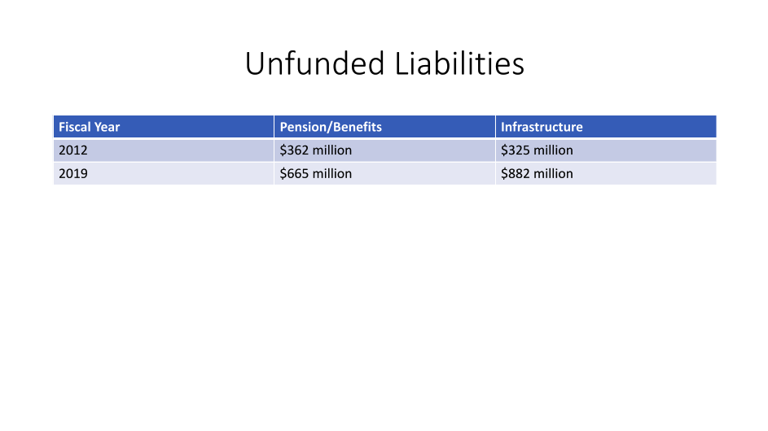
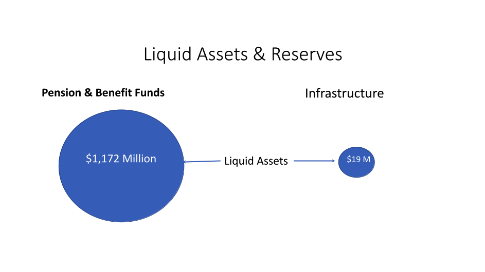

# Section 3
# Building on Current Infrastructure Planning

The City has prepared plans for many infrastructure systems. Some of the plans were done many years ago and some are recent. The Vision 2050 task force used the existing plans as the starting point. We want to build on what has been done and to add recommendations where it is needed. This section describes the City’s current plans and infrastructure improvement programs.

## Building on the City’s Planning

The Vision 2050 task force created a database of the City’s relevant infrastructure plans. The plans were reviewed and information was summarized in several ways, including their connection to:

- Infrastructure systems
- Core values
- Criteria from the Institute for Sustainable Infrastructure’s Envision program
- Date of preparation and current applicability

Over 20 plans were reviewed. The plans that provide the key guidance for our future include the:

- Climate Action Plan
- Resilience Strategy
- Capital Improvement Program

A summary of the current plans and their recommended actions are show on Appendix 2.

Our review found that the plans were prepared for specific purposes and often lacked integration. This is improving with the City Manager’s Strategic Plan and the recent Resilience Strategy. We also found no regular schedule for preparing or updating the plans. Some plans are current and applicable while others are out of date, incomplete, or have not been started. Many plans have been only partially implemented.

## Case Studies 

It is valuable to learn from projects and programs implemented in Berkeley. We can glean from these what has worked well and what attributes to carry to our future work. Positive case studies include the Climate Action Plan, Measure T1, and the Center Street Parking Garage. The attributes that have worked well include the following.

• Have an executive level “champion” for the project. This provides the vision and imperative for the project team.
• Involve the appropriate commissions early in the project. This will provide valuable input and buy in.
• Involve community organizations and the community, in general, to gain input and to educate them on the project.
• Develop options for the project based on the input. Screen the options based on multiple criteria and make recommendations.
• Provide status reports, including cost and schedule, on a regular basis to the public. This can be in reports to City Council, updates on websites, or in community meetings.

## Current Infrastructure Investments

Berkeley’s most recent Comprehensive Annual Financial Report (CAFR) for the fiscal year ending on June 30, 2018, listed the City’s total capital assets at about \\$850 million. In a March 19, 2019 report on Projections of Future Liabilities, the City Manager stated that the City’s largest unfunded liability of \\$786 million is infrastructure that has exceeded its useful lifespan. The available funding to address this failing infrastructure is about \\$33 million, which is about 4.2% of the total need. As a result, failing infrastructure is kept in service beyond its useful lifespan and the cost of replacement increases substantially due to inflation and construction cost escalation as shown in Figure 4.

Berkeley prepares a 5-year Capital Improvement Plan (CIP) and it is updated every two years. The CIP outlines the specific projects, schedule and the funding needs for the following infrastructure systems:

    • City facilities
    • Information systems
    • Parks and marina
    • Sanitary sewer
    • Storm drains
    • Sidewalk repairs
    • Street repairs
    • Transportation
    • Other infrastructure
    • Equipment
Projects shown in the CIP are typically systems that have been studied, are known to be deficient and improvements are needed to bring them back to acceptable use. There many infrastructure needs that have not yet made it into the CIP. The following table attempts to organize the needs into three categories.

<table>
<thead>
<tr class="header">
<th><strong>Category</strong></th>
<th><strong>Definition</strong></th>
<th><strong>Examples</strong></th>
<th><strong>Funding Needs, $millions</strong></th>
</tr>
</thead>
<tbody>
<tr class="odd">
<td>CIP projects</td>
<td>Projects that have conceptual planning completed and order of magnitude cost estimates prepared. These projects are ready to move to design and implementation once the funding is in place.</td>
<td><ul>
<li>
Sewer system improvements
</li>
<li>
Short term street improvements
</li>
<li>
Short term storm drain improvements
</li>
<li>
Building maintenance
</li>
</ul></td>
<td>200 - 300</td>
</tr>
<tr class="even">
<td>Known program needs</td>
<td>Projects where planning studies have been done but funding and implementation have not been approved. These projects are not in the CIP.</td>
<td><ul>
<li>
Watershed management plan projects
</li>
<li>
Marina improvements
</li>
<li>
Utility undergrounding
</li>
<li>
Sidewalk improvements
</li>
<li>
Municipal pier improvements
</li>
<li>
Green infrastructure program to comply with stormwater permit
</li>
</ul></td>
<td>300 - 400</td>
</tr>
<tr class="odd">
<td>Undefined program needs</td>
<td>Projects where planning studies have not been done yet but there is a known need for them in the future. These projects are not in the CIP.</td>
<td><ul>
<li>
Long term street improvements
</li>
<li>
Response to sea level rise
</li>
<li>
Civic center improvements
</li>
<li>
Waterfront improvements
</li>
</ul></td>
<td>200 - 300</td>
</tr>
<tr class="even">
<td><strong>Total</strong></td>
<td></td>
<td></td>
<td><strong>700 – 1,000</strong></td>
</tr>
</tbody>
</table>

The CIP, along with special revenue funds, bonds, enterprise funds, transfer taxes, and state and federal funding, provide the funds to maintain and construct our capital assets and infrastructure. Several recent actions by the voters have provided an important boost to the resources available for meeting these challenges:

**Measure T1**, authorizing the City to sell \\$100 million of General Obligation Bonds to repair, renovate, replace, or reconstruct the City’s aging infrastructure and facilities, including sidewalks, storm drains, parks, streets, senior and recreation centers, and other important City facilities and buildings.

**Measure F** (a countywide vehicle registration fee), increasing the Parks Tax revenues approximately 16.7% to support parks, playgrounds, city trees and landscaping operations and maintenance. Measure F provided an additional \\$750,000 per year to Berkeley for majormaintenance projects, raising annual funding for parks capital and major maintenance projects from \\$250,000 to \\$1 million.

**Measure BB** (a property tax assessment), which implements a 30 year Transportation Expenditure Plan. Berkeley’s allocation is approximately \\$2.6 million annually and is applied to improving the pavement condition and specific street/transportation improvement projects and increasing funding for local transportation enhancements. Measure BB will benefit the City’s streets and roads, pedestrian and bicycle infrastructure. Measure M (a general obligation bond), to provide an additional \\$30 million which is being used to significantly accelerate the implementation of the 5-Year Street Plan and install green infrastructure where appropriate, improving the condition of city streets and Green Infrastructure projects as defined in the Watershed Master Plan.

## Current Financial Challenges

The City has two major unfunded liabilities: Pension/Benefits and Infrastructure, both of which are increasing rapidly. From Fy2012 to FY2019, the unfunded liability for Pensions/Benefits almost doubled from \\$363 million to \\$665 million, whereas the Infrastructure unfunded liability almost tripled from \\$325 million to \\$882 million. See Table ___.

From FY2012 to FY2020, the City increased its annual funding of pension/benefits from \\$76.5 million to \\$115.6 million, which increased its total Pension/Benefits liquid reserves to \\$1,172 million.

Over the same time period, the City funding for infrastructure decreased \\$53.5 million to \\$39.8 million, while infrastructure unfunded liabilities tripled, which is clearly inadequate to maintain the City’s aging infrastructure, let alone modernize it.

Furthermore, most of the City’s capital assets do not have reserve funds associated with them, with the exception of vehicle, building maintenance and computer/servers, which total only \\$19 million, or fifty times smaller than the Pension/Benefits reserves.

Fig. 5  Liquid Assets & Reserves

While there are many fiscal challenges, the City has some opportunities as well. First, the public has shown its wiliness to support bond funding for infrastructure modernization by passing Measures M and T1. Second, the City demonstrated the benefits of a revenue-funded bond when it replaced the Center Street Parking Garage with a climate smart facility, using its cash flow from parking revenues. Third, in FY2020 the City will replace the destroyed Tuolumne Camp facility, funded primarily with insurance funds, with a modern facility. Fourth, the proposed 5-yearcapital budget for FYs2020 – 2024, increases capital spending to ~\\$67 million/year, which is a substantial increase over the previous plan.
