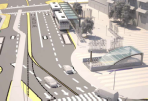
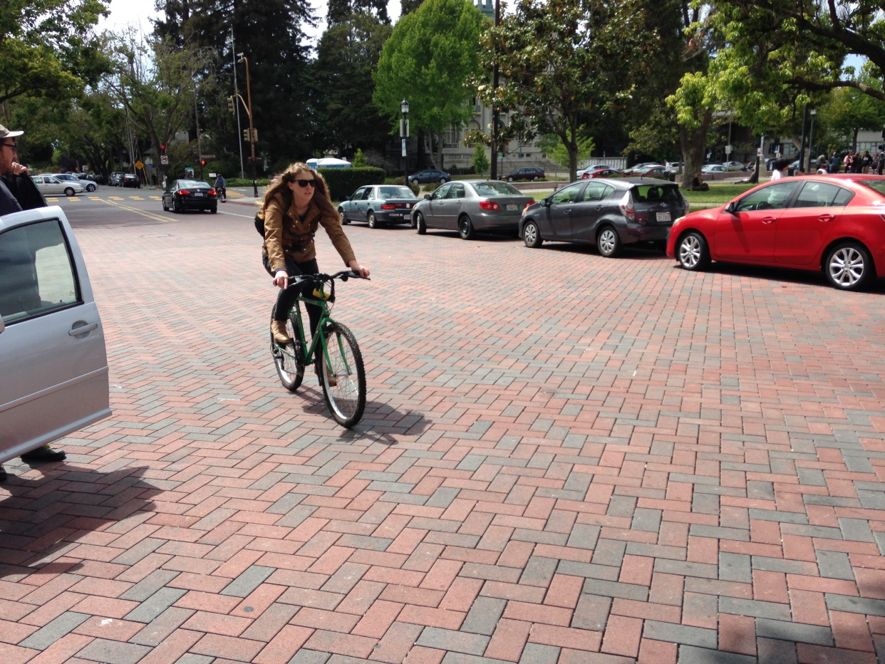
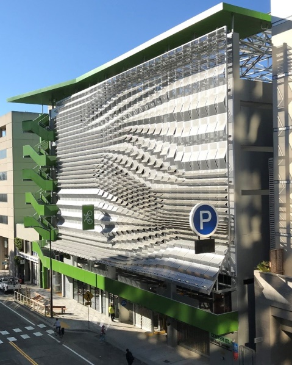

#### Sustainable and Resilient Infrastructure
# Creating a Better Future for our City
## Created by the
## Vision 2050 Task Force
## November 2019
#### WORKING DRAFT : 1 August 2019
#### In the Berkeley Free Speech tradition, this draft is published for comment, suggestion, and editing in a new format: JupyterBook format

### Note for all

 For the first time in urban planning practice, a working plan is published in an interactive book containing the actual calculations that lie behind all of the analysis.   JupyterBooks include Jupyter Notebooks, introduced at UCBerkeley to support all Data Science courses, which allow direct access to all data sources and, more importantly, to all computations and analyses based on that data.

 Our goal is open data, open analysis, open discussion, open decision making. Democracy relies upon common facts and agreed-upon common analysis of those facts.

##  If you don't like the analysis, then go out and make one of your own.

*Berkeley Capital Infrastructure Investments*

 
 *Permeable paving by Berkeley Aquatic Park*

 { width=50% }
 *Berkeley Downtown BART station*

 

 
 *Permeable paving by Berkeley High*

 
 *Your revenue bond dollars at work: Berkeley Downtown parking garage*
